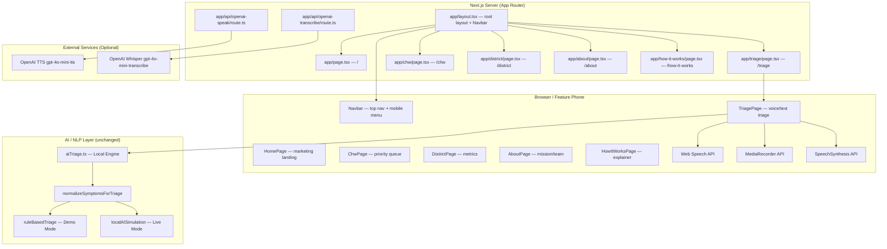
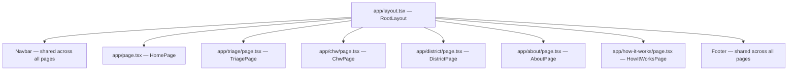
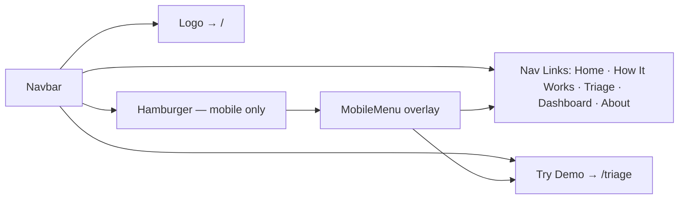
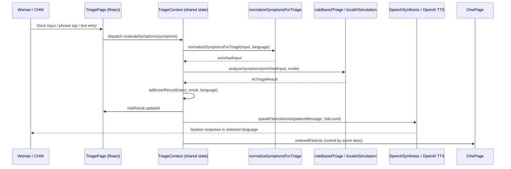
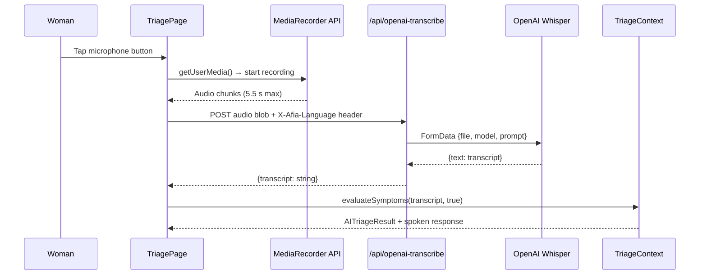
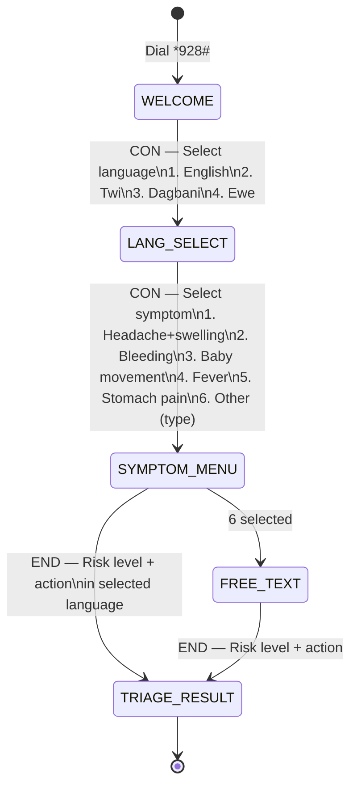
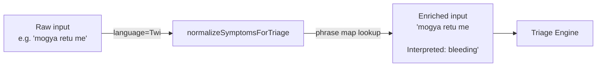
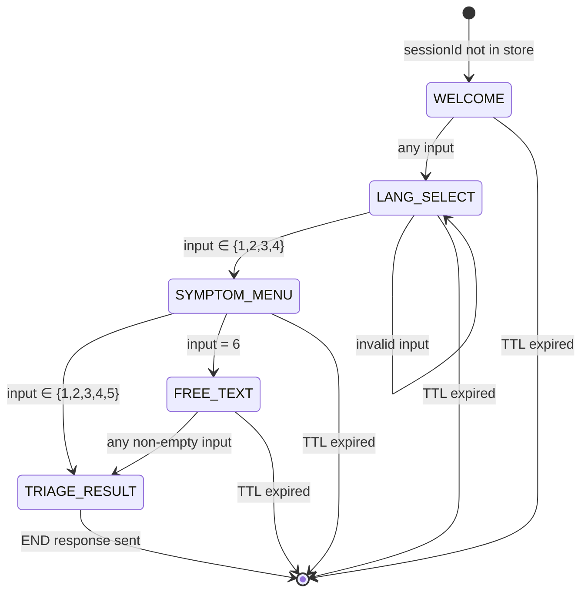

# Design Document: AfiaCare Website — Full Redesign

## Overview

AfiaCare is a multilingual, AI-powered maternal health companion targeting pregnant women in rural Ghana, community health workers (CHWs), district health officers, and NGO/government stakeholders. This redesign replaces the original single-page tab-based SPA with a proper multi-page Next.js App Router architecture, a new sea-blue-and-pink brand identity, and a full marketing home page — while preserving the existing AI triage pipeline, voice input/output, USSD simulation, and offline-first capabilities unchanged.

The redesign is structured in two parts: **Part 1 — High-Level Design** covers system architecture, multi-page routing, new component hierarchy, color system, navigation architecture, and all updated page/section breakdowns; **Part 2 — Low-Level Design** covers updated component prop interfaces, new page-level component specs, state management migration, and all existing algorithm sections (symptom normalisation, risk scoring, USSD state machine, PBT properties) which remain functionally unchanged.

---

# Part 1 — High-Level Design

## 1.1 System Architecture




## 1.2 Multi-Page Route Map

The application migrates from a single-page tab-based SPA to proper Next.js App Router multi-page routing. Each route is a distinct page with its own URL, enabling deep-linking, browser history, and SEO.

| Route | File | Page Component | Primary Audience | Purpose |
|---|---|---|---|---|
| `/` | `app/page.tsx` | `HomePage` | All audiences, NGO/Gov | Hero, value proposition, how it works, impact stats, CTAs |
| `/triage` | `app/triage/page.tsx` | `TriagePage` | Pregnant women, CHWs | Voice/text symptom input, language selector, AI triage results |
| `/chw` | `app/chw/page.tsx` | `ChwPage` | Community Health Workers | Patient priority queue, referral generation |
| `/district` | `app/district/page.tsx` | `DistrictPage` | District health officers, NGOs | Aggregate metrics, risk distribution by district |
| `/about` | `app/about/page.tsx` | `AboutPage` | All audiences | Mission, team, technology, partners |
| `/how-it-works` | `app/how-it-works/page.tsx` | `HowItWorksPage` | All audiences | Step-by-step explainer for each audience |

### Page Hierarchy (App Router)




## 1.3 Color System and Design Tokens

The dark navy/slate theme is replaced with a light, modern health-tech aesthetic. Sea blue is the primary brand color; pink is the accent for CTAs and emotional moments.

### Tailwind Custom Colors (`tailwind.config.js`)

```javascript
colors: {
  afia: {
    blue:         '#0EA5E9',  // primary sea blue — actions, headers, brand
    'blue-dark':  '#0284C7',  // hover states, active nav
    'blue-light': '#BAE6FD',  // backgrounds, tints
    pink:         '#EC4899',  // accent — CTAs, highlights, emotional moments
    'pink-light': '#FBCFE8',  // pink backgrounds, tints
    'pink-dark':  '#BE185D',  // pink hover states
  }
}
```

### Semantic Risk Colors (unchanged)

| Risk Level | Background | Text | Border |
|---|---|---|---|
| Emergency | `bg-red-50` | `text-red-700` | `border-red-300` |
| High | `bg-amber-50` | `text-amber-700` | `border-amber-300` |
| Medium | `bg-yellow-50` | `text-yellow-700` | `border-yellow-300` |
| Low | `bg-green-50` | `text-green-700` | `border-green-300` |

### Color Usage Guidelines

- **Sea blue** (`afia-blue`): Primary buttons, active nav links, section headings, brand logo, chart bars
- **Pink** (`afia-pink`): Secondary CTAs, accent badges, "Try Demo" button, emotional/human-interest sections
- **Neutral backgrounds**: `bg-white`, `bg-slate-50`, `bg-gray-50` — replace dark navy backgrounds
- **Body text**: `text-slate-700` on white; `text-slate-900` for headings
- **Labels/badges**: `uppercase tracking-widest text-xs` — small caps style


## 1.4 Navigation Architecture

### Desktop Navigation (Top Bar)

A sticky top navigation bar replaces the inline tab bar in the header. It contains:
- **Logo**: AfiaCare wordmark + icon, links to `/`
- **Nav links**: Home, How It Works, Triage, Dashboard, About — `text-slate-700 hover:text-afia-blue`
- **Active state**: `text-afia-blue font-semibold border-b-2 border-afia-blue`
- **CTA button**: "Try Demo" → `/triage` — `bg-afia-pink text-white rounded-full px-5 py-2`
- **AI Mode toggle**: Compact pill toggle (Demo / Live) — retained from current design

### Mobile Navigation (Hamburger Menu)

- Hamburger icon (≡) in top-right on screens < `md` breakpoint
- Opens a full-width slide-down or overlay menu with all nav links stacked vertically
- "Try Demo" CTA button at bottom of mobile menu
- Close button (✕) to dismiss




## 1.5 New Component Hierarchy

```mermaid
graph TD
    ROOT_LAYOUT[RootLayout]
    NAVBAR[Navbar]
    MOBILE_MENU[MobileMenu]
    FOOTER[Footer]

    HOME_PAGE[HomePage]
    HERO[HeroSection]
    HOW_IT_WORKS_SEC[HowItWorksSection]
    IMPACT[ImpactStatsSection]
    AUDIENCE[AudienceCards]
    USSD_CALLOUT[UssdCallout]
    TESTIMONIAL[TestimonialSection]

    TRIAGE_PAGE[TriagePage]
    LANG_SELECTOR[LanguageSelector — pill tabs]
    MIC_BTN[MicrophoneButton — centered prominent]
    PHRASE_BTNS[PhraseButtons]
    RISK_BADGE[RiskBadge — color-coded]
    RISK_CARD[RiskResultCard]

    CHW_PAGE[ChwPage]
    PATIENT_CARD[PatientCard — redesigned]
    REFERRAL_PANEL[ReferralPanel — slide-out/modal]
    CHW_SUMMARY[ChwSummaryPanel]

    DISTRICT_PAGE[DistrictPage]
    METRIC_CARD[MetricCard — with icon]
    BAR_CHART[DistrictBarChart — afia-blue bars]
    TREND[TrendIndicator]

    ABOUT_PAGE[AboutPage]
    HOW_PAGE[HowItWorksPage]

    ROOT_LAYOUT --> NAVBAR
    NAVBAR --> MOBILE_MENU
    ROOT_LAYOUT --> FOOTER
    ROOT_LAYOUT --> HOME_PAGE
    HOME_PAGE --> HERO
    HOME_PAGE --> HOW_IT_WORKS_SEC
    HOME_PAGE --> IMPACT
    HOME_PAGE --> AUDIENCE
    HOME_PAGE --> USSD_CALLOUT
    HOME_PAGE --> TESTIMONIAL
    ROOT_LAYOUT --> TRIAGE_PAGE
    TRIAGE_PAGE --> LANG_SELECTOR
    TRIAGE_PAGE --> MIC_BTN
    TRIAGE_PAGE --> PHRASE_BTNS
    TRIAGE_PAGE --> RISK_CARD
    RISK_CARD --> RISK_BADGE
    ROOT_LAYOUT --> CHW_PAGE
    CHW_PAGE --> PATIENT_CARD
    PATIENT_CARD --> RISK_BADGE
    CHW_PAGE --> REFERRAL_PANEL
    CHW_PAGE --> CHW_SUMMARY
    ROOT_LAYOUT --> DISTRICT_PAGE
    DISTRICT_PAGE --> METRIC_CARD
    DISTRICT_PAGE --> BAR_CHART
    DISTRICT_PAGE --> TREND
    ROOT_LAYOUT --> ABOUT_PAGE
    ROOT_LAYOUT --> HOW_PAGE
```




## 1.6 Home Page Section Breakdown

The home page is a full marketing/product page. Each section has a distinct purpose and visual treatment.

### Section 1: HeroSection

- **Layout**: Full-width, sea blue gradient background (`from-afia-blue to-afia-blue-dark`)
- **Content**: Headline "Saving Mothers. One Voice at a Time.", subheadline describing the platform, hero image (existing `ghana-nurse-pregnant-care.png`)
- **CTAs**: Two buttons — "Try Voice Demo" (pink, → `/triage`) and "View Dashboard" (white outline, → `/chw`)
- **Visual**: Overlapping image card on right side (desktop), stacked on mobile

### Section 2: HowItWorksSection

- **Layout**: 3-column card grid on desktop, stacked on mobile
- **Content**: Three steps — (1) Woman speaks in local language, (2) AI triages risk in seconds, (3) CHW receives alert and acts
- **Visual**: Numbered step circles in sea blue, icon per step, short description

### Section 3: ImpactStatsSection

- **Layout**: 4-column stat grid with animated counters
- **Stats**: 4 languages supported, 6 risk conditions detected, USSD on any phone, < 3 s triage time
- **Visual**: Large bold numbers in `afia-blue`, label below in `text-slate-500`

### Section 4: AudienceCards

- **Layout**: 3 cards side by side (desktop), stacked (mobile)
- **Cards**: Pregnant Women (pink accent), Community Health Workers (blue accent), District Officers (slate accent)
- **Each card**: Icon, title, 2-line description, CTA link

### Section 5: UssdCallout

- **Layout**: Full-width banner, sea blue background
- **Content**: "*928# — Works on any phone, no internet needed", brief explanation of USSD access
- **Visual**: Large `*928#` code in white, pink accent badge "Feature Phone Ready"

### Section 6: TestimonialSection

- **Layout**: Centered quote card
- **Content**: Placeholder quote from a CHW or pregnant woman (to be replaced with real quotes)
- **Visual**: Large quotation mark in `afia-pink-light`, italic text, attribution line

### Section 7: Footer

- **Layout**: 3-column grid — brand/tagline, nav links, contact/language selector
- **Content**: AfiaCare logo, tagline, nav links (Home, How It Works, Triage, Dashboard, About), language selector dropdown, contact email placeholder
- **Visual**: `bg-slate-900 text-slate-300`, sea blue logo accent


## 1.7 Redesigned Page Layouts

### TriagePage (`/triage`)

Replaces `UssdPage`. Two-column layout on desktop (input left, results right), single column on mobile.

- **Left column**: Language selector as pill tabs (English / Twi / Dagbani / Ewe), microphone as a large centered button (prominent, pink ring on active), symptom textarea, phrase buttons grid, submit button
- **Right column**: Results card with `RiskBadge` (color-coded by level), possible condition, top reasons, recommended action, patient message with "Play voice" button, nearest clinic, CHW alert
- **Color**: White card backgrounds, `afia-blue` accents, semantic risk colors for the result badge

### ChwPage (`/chw`)

Replaces `ChwDashboard`. Two-column layout — patient queue left, summary/referral right.

- **Patient queue**: `PatientCard` components with left-side risk color stripe (red/amber/yellow/green), patient name, district, gestational week, risk score, "Generate Referral" button
- **Referral panel**: Slide-out drawer or modal (desktop: side panel; mobile: bottom sheet) showing the generated referral note with copy-to-clipboard action
- **Summary panel**: New reports count, guidance text, high-risk threshold reminder

### DistrictPage (`/district`)

Replaces `DistrictMetrics`. Metric cards with icons + bar chart.

- **Metric cards**: 3 cards — High-risk cases (alert icon), Referrals sent (arrow icon), ANC follow-up rate (checkmark icon) — white cards with `afia-blue` icon backgrounds
- **Bar chart**: District risk distribution with `afia-blue` bars, district labels, case counts
- **Trend indicators**: Up/down arrows with percentage change (placeholder for demo)

### AboutPage (`/about`)

New page. Sections: Mission statement, Technology overview (AI triage + USSD + voice), Team placeholder cards, Partner logos placeholder.

### HowItWorksPage (`/how-it-works`)

New page. Three audience-specific explainer flows:
- For pregnant women: Dial *928# or open app → select language → describe symptoms → receive advice
- For CHWs: Receive alert → view priority queue → generate referral → follow up
- For district officers: View aggregate metrics → identify high-risk districts → coordinate response


## 1.8 Data Flow — AI Triage Pipeline (unchanged)

The AI triage pipeline is functionally identical to the original design. Only the UI layer changes.



## 1.9 Data Flow — Voice Input (unchanged)



**Fallback path (no internet / API key missing):** `transcribeLocalLanguageAudio` returns `null`; UI shows status message; phrase buttons remain fully functional offline.


## 1.10 USSD Flow Design (unchanged)

USSD operates on feature phones with no internet. The `*928#` code initiates a session. The flow is a linear menu tree navigated by numeric key presses.



**USSD Session State Machine (server-side):**

```typescript
interface UssdSession {
  sessionId: string;
  phoneNumber: string;
  language: SupportedLanguage | null;
  step: 'WELCOME' | 'LANG_SELECT' | 'SYMPTOM_MENU' | 'FREE_TEXT' | 'DONE';
  selectedSymptomIndex: number | null;
  freeTextInput: string | null;
  createdAt: number; // Unix ms
}
```

**USSD API Route Contract:**

```
POST /api/ussd
Content-Type: application/x-www-form-urlencoded
Body: sessionId, serviceCode, phoneNumber, text (accumulated input, "&"-delimited)

Response (text/plain):
  CON <menu text>   — session continues
  END <result text> — session ends
```

## 1.11 Multilingual Support Architecture (unchanged)

All language-specific content remains centralised in `src/data/appContent.ts` and `src/services/localLanguagePhrases.ts`. Adding a new language requires the same steps as before.

### Voice Architecture by Language

| Language | Input method | Output method |
|---|---|---|
| English | Web Speech API (SpeechRecognition) | Web SpeechSynthesis (en-US) |
| Twi | MediaRecorder → OpenAI Whisper | Web SpeechSynthesis (en-GH) + local phrase responses |
| Dagbani | MediaRecorder → OpenAI Whisper | Web SpeechSynthesis (dag-GH) + local phrase responses |
| Ewe | MediaRecorder → OpenAI Whisper | Web SpeechSynthesis (ee-GH) + local phrase responses |




## 1.12 Data Models (unchanged)

### AITriageResult

```typescript
interface AITriageResult {
  riskScore: number;           // 0–100 integer
  riskLevel: 'Low' | 'Medium' | 'High' | 'Emergency';
  possibleCondition: string;
  topReasons: string[];        // 1–3 reason strings
  recommendedAction: string;
  patientMessage: string;      // Patient-facing message (localised)
  chwAlertMessage: string;
  clinic: string;
  confidence: number;          // 0.0–1.0
  aiInsight?: string;          // Extended reasoning (live mode)
  priorityPrediction?: string; // Priority label (live mode)
}
```

### Patient

```typescript
interface Patient {
  name: string;
  age: number;           // years; 0 = unknown
  weeks: number;         // gestational weeks; 0 = unknown
  reason: string;        // First line of symptom input (truncated to 90 chars)
  score: number;         // riskScore from AITriageResult
  district: string;
  language?: Language;
  riskLevel?: 'Low' | 'Medium' | 'High' | 'Emergency';
  createdAt?: string;    // HH:MM display string
}
```

### LocalLanguagePhrase

```typescript
interface LocalLanguagePhrase {
  id: string;
  label: string;
  text: string;
  englishSymptoms: string;
  response: string;
  riskLevel: AITriageResult['riskLevel'];
}
```

### DistrictDataPoint

```typescript
interface DistrictDataPoint {
  district: string;
  cases: number;
}
```

## 1.13 Integration Points (unchanged)

| Integration | Direction | Protocol | Auth | Fallback |
|---|---|---|---|---|
| OpenAI Whisper (`gpt-4o-mini-transcribe`) | Client → Server → OpenAI | HTTPS REST | `OPENAI_API_KEY` env var | Return `null`; show "type symptoms" message |
| OpenAI TTS (`gpt-4o-mini-tts`) | Client → Server → OpenAI | HTTPS REST | `OPENAI_API_KEY` env var | Web SpeechSynthesis API |
| USSD Gateway (Africa's Talking / Hubtel) | Gateway → Next.js Server | HTTP POST form-encoded | Shared secret header | N/A (server-side only) |
| Web Speech API | Browser native | Browser API | Microphone permission | MediaRecorder fallback for local languages |
| Web SpeechSynthesis | Browser native | Browser API | None | Silent (no crash) |

## 1.14 Offline-First / Low-Bandwidth Considerations (updated)

- **Demo mode triage** runs entirely in-browser with zero network calls.
- **Phrase buttons** are pre-loaded static data — fully offline.
- **Light theme** improves readability on low-quality mobile screens compared to the previous dark theme.
- **USSD channel** requires no smartphone or internet — works on any GSM feature phone.
- **No heavy animation libraries**: ImpactStats counters use CSS transitions or a minimal `requestAnimationFrame` counter — no GSAP or Framer Motion.
- **No charting library**: District bar chart remains pure CSS width percentages.
- **Images**: Hero image served from `/public/images`. All images should use Next.js `<Image>` component for WebP conversion and lazy loading.

## 1.15 Accessibility (updated)

- **Voice-first**: Microphone button is the primary interaction affordance on TriagePage.
- **Light theme**: Higher contrast on low-quality screens; `text-slate-900` on white meets WCAG AA.
- **Large tap targets**: All buttons use generous padding, suitable for touch screens.
- **TTS on result**: Patient message spoken automatically after triage.
- **Phrase buttons**: Pre-written local-language phrases allow zero-literacy interaction.
- **USSD**: Numeric menu navigation requires only number key presses.
- **Risk badges**: Color-coded AND labeled (never color-only) to support color-blind users.
- **Mobile hamburger menu**: Keyboard-accessible with `aria-expanded`, `aria-controls`, focus trap.


---

# Part 2 — Low-Level Design

## 2.1 Key Algorithms (unchanged)

### 2.1.1 Symptom Normalisation

**Purpose:** Translate local-language symptom phrases into English tokens that the triage engine can score.

```typescript
function normalizeSymptomsForTriage(
  input: string,
  language: SupportedLanguage
): string
```

**Preconditions:**
- `input` is a non-empty string (may contain local-language text, English, or mixed)
- `language` is a valid `SupportedLanguage` value

**Postconditions:**
- Returns the original `input` unchanged if no phrase matches are found
- Returns `input + "\n\nInterpreted symptoms: " + uniqueMatches.join(', ')` when matches exist
- Matching is case-insensitive substring search
- Duplicate English symptom labels are deduplicated via `Set`
- The original input is always preserved (non-destructive enrichment)

**Loop Invariant:** For each phrase entry processed, all previously matched English symptoms remain in the result set.

```pascal
FUNCTION normalizeSymptomsForTriage(input, language)
  phrases ← localLanguageSymptomMap[language]
  matches ← []

  FOR EACH (phrase, englishSymptom) IN phrases DO
    IF input.toLowerCase() CONTAINS phrase.toLowerCase() THEN
      matches.ADD(englishSymptom)
    END IF
  END FOR

  uniqueMatches ← SET(matches)

  IF uniqueMatches IS EMPTY THEN
    RETURN input
  END IF

  RETURN input + "\n\nInterpreted symptoms: " + JOIN(uniqueMatches, ", ")
END FUNCTION
```

### 2.1.2 Risk Scoring — Demo Mode (Rule-Based Triage)

```typescript
function ruleBasedTriage(input: string): AITriageResult
```

**Decision Table:**

| Condition | riskScore | riskLevel | possibleCondition |
|---|---|---|---|
| `bleeding` present | 95 | Emergency | Obstetric hemorrhage |
| `headache` AND `swelling` | 80 | High | Severe preeclampsia |
| `reduced baby movement` / `baby movement` | 82 | High | Fetal distress |
| `fever` | 55 | Medium | Possible infection |
| `no anc` / `no antenatal` | 50 | Medium | Delayed antenatal care |
| None of the above | 25 | Low | Routine pregnancy |

```pascal
FUNCTION ruleBasedTriage(input)
  normalized ← input.toLowerCase()

  IF normalized CONTAINS "bleeding" THEN
    RETURN emergencyResult("Obstetric hemorrhage", 95, 0.98)
  END IF

  IF normalized CONTAINS "headache" AND normalized CONTAINS "swelling" THEN
    RETURN highResult("Severe preeclampsia", 80, 0.92)
  END IF

  IF normalized CONTAINS "reduced baby movement"
     OR normalized CONTAINS "baby movement" THEN
    RETURN highResult("Fetal distress", 82, 0.89)
  END IF

  IF normalized CONTAINS "fever" THEN
    RETURN mediumResult("Possible infection", 55, 0.85)
  END IF

  IF normalized CONTAINS "no anc"
     OR normalized CONTAINS "no antenatal" THEN
    RETURN mediumResult("Delayed antenatal care", 50, 0.84)
  END IF

  RETURN lowResult("Routine pregnancy", 25, 0.95)
END FUNCTION
```


### 2.1.3 Risk Scoring — Live Mode (Advanced AI Simulation)

```typescript
function localAISimulation(input: string): AITriageResult
```

**Postconditions:**
- `riskScore` ∈ [0, 100]
- `riskLevel` determined by `determineRiskLevel(riskScore)`: score ≥ 85 → Emergency, ≥ 70 → High, ≥ 40 → Medium, < 40 → Low
- `confidence` ∈ [0.75, 0.99]
- `aiInsight` and `priorityPrediction` always populated in live mode

```pascal
FUNCTION calculateAdvancedRiskScore(factors, context)
  score ← 0

  IF factors.emergencyIndicators IS NOT EMPTY THEN
    score ← 95 + LENGTH(factors.emergencyIndicators)
  END IF

  IF LENGTH(factors.severityMarkers) >= 2 THEN
    score ← MAX(score, 80 + LENGTH(factors.severityMarkers) * 5)
  ELSE IF LENGTH(factors.severityMarkers) = 1 THEN
    score ← MAX(score, 70)
  END IF

  IF factors.accessBarriers IS NOT EMPTY THEN
    score ← MAX(score, 50 + LENGTH(factors.accessBarriers) * 10)
  END IF

  IF context.symptomBurden >= 3 THEN
    score ← MIN(100, score * 1.15)
  END IF

  RETURN MIN(100, ROUND(score))
END FUNCTION
```

**Loop Invariant (symptom parsing):** For each symptom keyword checked, `score` is monotonically non-decreasing.

### 2.1.4 Language Detection Algorithm

```typescript
function detectLanguage(
  input: string,
  candidates: SupportedLanguage[]
): SupportedLanguage | null
```

```pascal
FUNCTION detectLanguage(input, candidates)
  bestLanguage ← null
  bestCount ← 0

  FOR EACH language IN candidates DO
    IF language = "English" THEN CONTINUE END IF

    phrases ← localLanguageSymptomMap[language]
    count ← 0

    FOR EACH phrase IN KEYS(phrases) DO
      IF input.toLowerCase() CONTAINS phrase.toLowerCase() THEN
        count ← count + 1
      END IF
    END FOR

    IF count > bestCount THEN
      bestCount ← count
      bestLanguage ← language
    END IF
  END FOR

  IF bestCount = 0 THEN RETURN null END IF
  RETURN bestLanguage
END FUNCTION
```


## 2.2 Function Signatures for Core Services (unchanged)

### aiTriage.ts

```typescript
export async function analyzeSymptoms(
  input: string,
  mode: 'demo' | 'live',
  language: SupportedLanguage
): Promise<AITriageResult>

export function normalizeSymptomsForTriage(
  input: string,
  language: SupportedLanguage
): string

function ruleBasedTriage(input: string): AITriageResult
function localAISimulation(input: string): AITriageResult
function parseSymptoms(input: string): SymptomProfile
function analyzeRiskFactors(symptoms: SymptomProfile): RiskFactors
function calculateAdvancedRiskScore(
  factors: RiskFactors,
  context: { symptomBurden: number; acuity: number; hasEmergencyFeature: boolean }
): number
function determineRiskLevel(score: number): 'Low' | 'Medium' | 'High' | 'Emergency'
function calculateConfidence(factors: RiskFactors, input: string): number
```

### twiSpeech.ts

```typescript
export async function transcribeLocalLanguageAudio(
  audio: Blob,
  language: SupportedLanguage
): Promise<string | null>
```

### aiSpeech.ts

```typescript
export async function speakWithAIUnavailable(
  text: string,
  language: SupportedLanguage
): Promise<boolean>

export async function speakWithAI(
  text: string,
  language: SupportedLanguage
): Promise<boolean>
```

## 2.3 Updated Component Props Interfaces

### Navbar

```typescript
interface NavbarProps {
  // No props — reads active route from Next.js usePathname()
  // AI mode toggle state lives in TriageContext
}
```

### MobileMenu

```typescript
interface MobileMenuProps {
  isOpen: boolean;
  onClose: () => void;
}
```

### Footer

```typescript
interface FooterProps {
  // No props — static content
}
```

### HeroSection

```typescript
interface HeroSectionProps {
  // No props — static content with internal navigation links
}
```

### HowItWorksSection

```typescript
interface HowItWorksSectionProps {
  // No props — static 3-step content
}
```

### ImpactStatsSection

```typescript
interface ImpactStatsSectionProps {
  // No props — static stats with CSS counter animation
}
```

### AudienceCards

```typescript
interface AudienceCardsProps {
  // No props — static card content
}
```

### UssdCallout

```typescript
interface UssdCalloutProps {
  // No props — static content
}
```

### TestimonialSection

```typescript
interface TestimonialSectionProps {
  quote: string;
  attribution: string;
}
```


### TriagePage (replaces UssdPage)

```typescript
// TriagePage is a Next.js page component ('use client')
// All triage state is managed via TriageContext (see 2.4)
// No props — reads/writes context directly
```

### LanguageSelector

```typescript
interface LanguageSelectorProps {
  selected: Language;
  onChange: (language: Language) => void;
}
```

### MicrophoneButton

```typescript
interface MicrophoneButtonProps {
  listening: boolean;
  language: Language;
  onClick: () => void;
}
```

### RiskBadge

```typescript
type RiskLevel = 'Low' | 'Medium' | 'High' | 'Emergency';

interface RiskBadgeProp {
  level: RiskLevel;
  score?: number;       // Optional — show numeric score alongside label
  size?: 'sm' | 'md' | 'lg';  // Default: 'md'
}
```

**Color mapping:**

```typescript
const riskBadgeStyles: Record<RiskLevel, string> = {
  Emergency: 'bg-red-100 text-red-700 border border-red-300',
  High:      'bg-amber-100 text-amber-700 border border-amber-300',
  Medium:    'bg-yellow-100 text-yellow-700 border border-yellow-300',
  Low:       'bg-green-100 text-green-700 border border-green-300',
};
```

### RiskResultCard

```typescript
interface RiskResultCardProps {
  result: RiskResult;
  onSpeakPatientMessage: () => void;
}
```

### PatientCard (replaces inline patient row in ChwDashboard)

```typescript
interface PatientCardProps {
  patient: Patient;
  onGenerateReferral: (patient: Patient) => void;
}
```

**Visual spec:**
- Left border stripe: 4px solid, color matches `RiskBadge` level (red/amber/yellow/green)
- Patient name + age in `font-semibold text-slate-900`
- District + gestational week + language + time in `text-sm text-slate-500`
- `RiskBadge` component in top-right corner
- Reason text in `text-slate-600`
- "Generate Referral" button: `bg-afia-blue text-white rounded-full` (replaces mint green)

### ReferralPanel

```typescript
interface ReferralPanelProps {
  note: string | null;
  isOpen: boolean;
  onClose: () => void;
}
```

**Behavior:** Slide-out side panel on desktop (fixed right, `w-96`), bottom sheet on mobile. Contains referral note text, copy-to-clipboard button, close button.

### ChwSummaryPanel

```typescript
interface ChwSummaryPanelProps {
  newReportCount: number;
  highRiskCount: number;
}
```

### MetricCard

```typescript
interface MetricCardProps {
  label: string;
  value: string | number;
  description: string;
  icon: React.ReactNode;
  trend?: 'up' | 'down' | 'neutral';
  trendValue?: string;  // e.g. "+3 this week"
}
```

### DistrictBarChart

```typescript
interface DistrictBarChartProps {
  data: DistrictDataPoint[];
  maxCases?: number;  // Auto-computed from data if omitted
}
```

**Bar color:** `bg-afia-blue` (replaces `bg-sky-500`)

### TrendIndicator

```typescript
interface TrendIndicatorProps {
  direction: 'up' | 'down' | 'neutral';
  label: string;
}
```


## 2.4 State Management — Migration from App.tsx to Per-Page + Shared Context

The original design centralises all state in `App.tsx` via prop drilling. The multi-page architecture requires a different approach: triage state (which must persist across the `/triage` → `/chw` flow) moves to a shared React Context; page-local state stays local.

### TriageContext (shared across /triage and /chw)

```typescript
interface TriageContextValue {
  // Language selection
  language: Language;
  setLanguage: (lang: Language) => void;

  // Triage input/output
  symptoms: string;
  setSymptoms: (s: string) => void;
  riskResult: RiskResult | null;
  loading: boolean;
  apiKeyError: string | null;

  // Voice input
  listening: boolean;
  speechStatus: string | null;

  // AI mode
  aiMode: 'demo' | 'live';
  setAiMode: (mode: 'demo' | 'live') => void;
  hasServerAI: boolean;

  // Patient records (session-scoped, feeds ChwPage)
  userRecords: Patient[];

  // Actions
  evaluateSymptoms: (input: string, shouldSpeak?: boolean) => Promise<void>;
  startSpeechInput: () => Promise<void>;
  useLocalDemoPhrase: (phrase: LocalLanguagePhrase) => Promise<void>;
  speakPatientMessage: () => void;
}
```

**Provider placement:** `TriageProvider` wraps the root layout so both `/triage` and `/chw` can access shared patient records.

### ChwPage local state

```typescript
// Local to ChwPage — not shared
const [referralNote, setReferralNote] = useState<string | null>(null);
const [referralPanelOpen, setReferralPanelOpen] = useState(false);
const [selectedPatient, setSelectedPatient] = useState<Patient | null>(null);
```

### DistrictPage local state

```typescript
// Derived from TriageContext.userRecords — no local state needed
// totalHighRisk, referralsSent, ancFollowUp computed via useMemo
```

### Navbar local state

```typescript
// Local to Navbar
const [mobileMenuOpen, setMobileMenuOpen] = useState(false);
```

### State Transition Rules (unchanged)

- `riskResult` is reset to `null` when the user changes language.
- `userRecords` is append-only during a session; records are prepended (newest first).
- `listening` and `loading` are mutually exclusive.
- `apiKeyError` is cleared at the start of each `evaluateSymptoms` call.


## 2.5 API Route Contracts (unchanged)

### POST /api/openai-transcribe

**Request:**
```
Method: POST
Headers:
  Content-Type: audio/webm
  X-Afia-Language: 'Twi' | 'Dagbani' | 'Ewe' | 'English'
Body: raw audio bytes
```

**Response (200):** `{ "transcript": "me ti yare na me nan nso ahon" }`
**Response (400):** `{ "error": "Missing audio" }`
**Response (500):** `{ "error": "Missing OPENAI_API_KEY" }`
**Response (503):** `{ "error": "Speech transcription is unavailable right now", "transcript": "" }`

**Invariants:** `transcript` is always a string in the 200 response; trimmed; API key never sent to client.

### POST /api/openai-speak

**Request:**
```
Method: POST
Content-Type: application/json
Body: { "text": string, "language": "English" | "Twi" | "Dagbani" | "Ewe" }
```

**Response (200):** `Content-Type: audio/mpeg` — MP3 audio bytes
**Response (400):** `{ "error": "Missing text" }`
**Response (500):** `{ "error": "Missing OPENAI_API_KEY" }`
**Response (503):** `{ "error": "Speech service unavailable" }`

### POST /api/ussd (planned)

**Request:** `application/x-www-form-urlencoded` — `sessionId, serviceCode, phoneNumber, text`
**Response:** `text/plain` — `CON <menu>` or `END <result>`

**Invariants:** Response always starts with `CON ` or `END `; `END` responses include patient message in session language; sessions expire after 120 s.

## 2.6 USSD Session State Machine (unchanged)



```pascal
FUNCTION handleUssdRequest(sessionId, phoneNumber, text)
  session ← sessionStore.get(sessionId)

  IF session IS NULL THEN
    session ← createSession(sessionId, phoneNumber)
    RETURN CON welcomeMessage()
  END IF

  steps ← SPLIT(text, "&")
  currentInput ← LAST(steps)

  MATCH session.step WITH
    CASE "WELCOME":
      session.step ← "LANG_SELECT"
      RETURN CON languageMenu()

    CASE "LANG_SELECT":
      lang ← languageFromInput(currentInput)
      IF lang IS NULL THEN
        RETURN CON "Invalid choice.\n" + languageMenu()
      END IF
      session.language ← lang
      session.step ← "SYMPTOM_MENU"
      RETURN CON symptomMenu(lang)

    CASE "SYMPTOM_MENU":
      IF currentInput = "6" THEN
        session.step ← "FREE_TEXT"
        RETURN CON promptFreeText(session.language)
      END IF
      symptom ← symptomFromIndex(currentInput, session.language)
      IF symptom IS NULL THEN
        RETURN CON "Invalid choice.\n" + symptomMenu(session.language)
      END IF
      result ← ruleBasedTriage(symptom)
      session.step ← "DONE"
      RETURN END formatUssdResult(result, session.language)

    CASE "FREE_TEXT":
      result ← ruleBasedTriage(currentInput)
      session.step ← "DONE"
      RETURN END formatUssdResult(result, session.language)
  END MATCH
END FUNCTION
```


## 2.7 CHW Decision Support — Referral Generation (unchanged)

```typescript
function generateReferralNote(patient: Patient): string
```

**Urgency tiers:**
- score ≥ 85 → "immediately — emergency transport required"
- score ≥ 70 → "within 24 hours"
- score ≥ 40 → "within 48–72 hours"
- score < 40 → "at next scheduled ANC visit"

```pascal
FUNCTION generateReferralNote(patient)
  urgency ← MATCH patient.score WITH
    score >= 85 → "immediately — emergency transport required"
    score >= 70 → "within 24 hours"
    score >= 40 → "within 48–72 hours"
    ELSE        → "at next scheduled ANC visit"
  END MATCH

  RETURN "Referral for " + patient.name + ": prioritise clinic appointment "
       + urgency + " due to " + LOWERCASE(patient.reason)
       + ". Contact CHW team and arrange transport."
END FUNCTION
```

## 2.8 District Analytics — Metrics Derivation (unchanged)

```typescript
const totalHighRisk: number = orderedPatients.filter(p => p.score >= 80).length;
const referralsSent: number = 18 + userRecords.filter(p => p.score >= 70).length;
const ancFollowUp: number = 86; // static baseline for demo
```

**Bar chart normalisation:**

```pascal
FUNCTION barWidth(cases, maxCases)
  RETURN (cases / maxCases) * 100  // percentage width
END FUNCTION
```

**Precondition:** `maxCases > 0`
**Postcondition:** result ∈ [0, 100]

## 2.9 Error Handling (unchanged)

| Scenario | Detection | Response | Recovery |
|---|---|---|---|
| OpenAI API key missing | `!process.env.OPENAI_API_KEY` in route | 500 JSON error | Show "type symptoms" fallback |
| OpenAI transcription failure | `!openAIResponse.ok` | 503 JSON + empty transcript | Phrase buttons remain available |
| OpenAI TTS failure | `!openAIResponse.ok` | 503 JSON | Web SpeechSynthesis fallback |
| Microphone permission denied | `getUserMedia` throws | `setSpeechStatus` error message | User can type symptoms manually |
| No speech captured | `finalTranscript` empty on `onend` | Status: "No voice captured" | User can retry or type |
| Live AI mode without server integration | `!hasServerAI` check | `setApiKeyError` message | Demo mode remains available |
| USSD invalid input | Input not in expected set | Re-prompt with same menu | Session continues |
| USSD session TTL expired | `Date.now() - session.createdAt > 120000` | Session deleted | User redials |


## 2.10 Testing Strategy

### Unit Testing Approach

Test each pure function in isolation using Vitest:

- `normalizeSymptomsForTriage`: all four languages, empty input, no-match input, multi-match input
- `ruleBasedTriage`: each decision branch, boundary conditions
- `calculateAdvancedRiskScore`: emergency/high/medium/low factor combinations
- `determineRiskLevel`: boundary values (84, 85, 69, 70, 39, 40)
- `generateReferralNote`: all urgency tiers
- `detectLanguage`: single-language match, multi-language tie, no match
- `RiskBadge`: renders correct color class for each risk level
- `PatientCard`: renders left border stripe color matching risk level
- `barWidth`: returns 0 for 0 cases, 100 for maxCases, proportional values in between

### Property-Based Testing Approach

**Library:** `fast-check` (TypeScript-native, compatible with Vitest)

Install: `npm install --save-dev fast-check`

#### Property 1: Risk score is always in [0, 100]

```typescript
// ∀ input: string, mode: 'demo' | 'live' →
//   analyzeSymptoms(input, mode, 'English').riskScore ∈ [0, 100]
fc.assert(
  fc.asyncProperty(fc.string(), fc.constantFrom('demo', 'live'), async (input, mode) => {
    const result = await analyzeSymptoms(input, mode, 'English');
    return result.riskScore >= 0 && result.riskScore <= 100;
  })
);
```

#### Property 2: Risk level is consistent with risk score

```typescript
// ∀ input: string →
//   riskLevel = 'Emergency' ↔ riskScore ≥ 85
//   riskLevel = 'High'      ↔ riskScore ∈ [70, 84]
//   riskLevel = 'Medium'    ↔ riskScore ∈ [40, 69]
//   riskLevel = 'Low'       ↔ riskScore < 40
fc.assert(
  fc.asyncProperty(fc.string(), async (input) => {
    const result = await analyzeSymptoms(input, 'live', 'English');
    const { riskScore, riskLevel } = result;
    if (riskScore >= 85) return riskLevel === 'Emergency';
    if (riskScore >= 70) return riskLevel === 'High';
    if (riskScore >= 40) return riskLevel === 'Medium';
    return riskLevel === 'Low';
  })
);
```

#### Property 3: Normalisation is non-destructive

```typescript
// ∀ input: string, language: SupportedLanguage →
//   normalizeSymptomsForTriage(input, language).startsWith(input)
fc.assert(
  fc.property(
    fc.string(),
    fc.constantFrom('English', 'Twi', 'Dagbani', 'Ewe'),
    (input, language) => {
      const result = normalizeSymptomsForTriage(input, language as SupportedLanguage);
      return result.startsWith(input);
    }
  )
);
```

#### Property 4: Bleeding input always produces Emergency

```typescript
// ∀ prefix: string, suffix: string →
//   analyzeSymptoms(prefix + 'bleeding' + suffix, 'demo', 'English').riskLevel = 'Emergency'
fc.assert(
  fc.asyncProperty(fc.string(), fc.string(), async (prefix, suffix) => {
    const result = await analyzeSymptoms(`${prefix}bleeding${suffix}`, 'demo', 'English');
    return result.riskLevel === 'Emergency';
  })
);
```

#### Property 5: Confidence is always in [0, 1]

```typescript
// ∀ input: string →
//   analyzeSymptoms(input, 'live', 'English').confidence ∈ [0.0, 1.0]
fc.assert(
  fc.asyncProperty(fc.string(), async (input) => {
    const result = await analyzeSymptoms(input, 'live', 'English');
    return result.confidence >= 0 && result.confidence <= 1;
  })
);
```

#### Property 6: topReasons is non-empty and has at most 3 items

```typescript
// ∀ input: string →
//   1 ≤ LENGTH(analyzeSymptoms(input, mode, lang).topReasons) ≤ 3
fc.assert(
  fc.asyncProperty(
    fc.string(),
    fc.constantFrom('demo', 'live'),
    fc.constantFrom('English', 'Twi', 'Dagbani', 'Ewe'),
    async (input, mode, language) => {
      const result = await analyzeSymptoms(input, mode as 'demo' | 'live', language as SupportedLanguage);
      return result.topReasons.length >= 1 && result.topReasons.length <= 3;
    }
  )
);
```

#### Property 7: Normalisation is idempotent

```typescript
// ∀ input: string, language: SupportedLanguage →
//   normalize(normalize(input, lang), lang) = normalize(input, lang)
fc.assert(
  fc.property(
    fc.string(),
    fc.constantFrom('English', 'Twi', 'Dagbani', 'Ewe'),
    (input, language) => {
      const once = normalizeSymptomsForTriage(input, language as SupportedLanguage);
      const twice = normalizeSymptomsForTriage(once, language as SupportedLanguage);
      return once === twice;
    }
  )
);
```

#### Property 8: Higher symptom severity never produces lower risk score (monotonicity)

```typescript
// Adding 'bleeding' to any input never decreases the risk score
fc.assert(
  fc.asyncProperty(fc.string(), async (input) => {
    const base = await analyzeSymptoms(input, 'demo', 'English');
    const withBleeding = await analyzeSymptoms(input + ' bleeding', 'demo', 'English');
    return withBleeding.riskScore >= base.riskScore;
  })
);
```

#### Property 9: RiskBadge always renders a non-empty class string for any valid risk level

```typescript
// ∀ level: RiskLevel →
//   riskBadgeStyles[level] is a non-empty string
fc.assert(
  fc.property(
    fc.constantFrom('Low', 'Medium', 'High', 'Emergency'),
    (level) => {
      const style = riskBadgeStyles[level as RiskLevel];
      return typeof style === 'string' && style.length > 0;
    }
  )
);
```

#### Property 10: barWidth is always in [0, 100] for valid inputs

```typescript
// ∀ cases: number ∈ [0, maxCases], maxCases: number > 0 →
//   barWidth(cases, maxCases) ∈ [0, 100]
fc.assert(
  fc.property(
    fc.integer({ min: 1, max: 1000 }),
    fc.integer({ min: 0, max: 1000 }),
    (maxCases, cases) => {
      const clampedCases = Math.min(cases, maxCases);
      const width = (clampedCases / maxCases) * 100;
      return width >= 0 && width <= 100;
    }
  )
);
```


### Integration Testing Approach

- **API routes**: POST to `/api/openai-transcribe` and `/api/openai-speak` with mock audio/text, asserting response shape and status codes.
- **USSD flow**: Simulate a full session by calling the USSD handler with sequential `text` values (`""`, `"1"`, `"1&2"`) and asserting `CON`/`END` prefixes and language-correct content.
- **Triage pipeline end-to-end**: Feed known local-language phrases through `normalizeSymptomsForTriage` → `analyzeSymptoms` and assert the expected `riskLevel` matches the phrase's declared `riskLevel` in `localLanguagePhrases.ts`.
- **TriageContext**: Render `TriageProvider` with a test consumer; assert that `evaluateSymptoms` updates `riskResult` and appends to `userRecords`.
- **Navigation**: Verify that all 6 routes render without error and that the Navbar marks the correct link as active.

## 2.11 Performance Considerations (updated)

- **Demo mode triage** completes synchronously in < 1 ms.
- **Live mode** adds an artificial 800 ms delay to simulate AI processing.
- **OpenAI Whisper** round-trip is typically 1–3 seconds. UI shows "Listening..." and "Writing text..." states.
- **MediaRecorder** caps recording at 5.5 seconds (typically < 200 KB for webm).
- **`useMemo`** on `orderedPatients` and `totalHighRisk` prevents re-sorting on every render.
- **Next.js `<Image>`**: Use for all images — automatic WebP conversion, lazy loading, `sizes` prop for responsive images.
- **No charting library**: District bar chart remains pure CSS. No JS charting bundle.
- **No animation library**: ImpactStats counters use `requestAnimationFrame` or CSS `@keyframes` — no GSAP or Framer Motion.
- **Route-level code splitting**: Next.js App Router automatically code-splits per page — each page only loads its own JS.
- **Static pages**: `/about` and `/how-it-works` can be statically generated (`generateStaticParams` or default static rendering) — zero server cost.

## 2.12 Security Considerations (unchanged)

- **API key protection**: `OPENAI_API_KEY` is only accessed server-side. Never sent to client or logged.
- **Input sanitisation**: Symptom text is passed to the local triage engine as a plain string — no SQL, no shell execution, no eval.
- **USSD shared secret**: The USSD gateway should send a shared secret header (`X-Afia-Secret`). The API route must validate this before processing.
- **Rate limiting**: `/api/openai-transcribe` and `/api/openai-speak` should be rate-limited per IP (e.g., `@upstash/ratelimit`).
- **HTTPS only**: All production deployments must use HTTPS. MediaRecorder and SpeechRecognition APIs require a secure context.
- **No PII storage**: Patient records are stored in React Context only (session-scoped, never persisted). Any production persistence layer must comply with Ghana's Data Protection Act 2012.

## 2.13 Dependencies (updated)

| Package | Version | Purpose |
|---|---|---|
| `next` | ^16.2.6 | Framework, App Router, API routes, SSR/SSG |
| `react` / `react-dom` | ^18.3.1 | UI rendering |
| `typescript` | ^5.6.2 | Type safety |
| `tailwindcss` | ^3.4.4 | Utility-first styling |
| `fast-check` | latest | Property-based testing (to be added) |
| `vitest` | latest | Test runner (to be added) |
| OpenAI API | gpt-4o-mini-tts, gpt-4o-mini-transcribe | TTS + STT (optional, server-side only) |

**Browser APIs (no install required):**
- `Web Speech API` (SpeechRecognition, SpeechSynthesis)
- `MediaRecorder API`
- `getUserMedia` (MediaDevices)
- `Audio` (HTMLAudioElement)

**Removed dependencies (from old design):**
- No new dependencies added for the redesign — color system, navigation, and new sections are implemented with existing Tailwind CSS.
